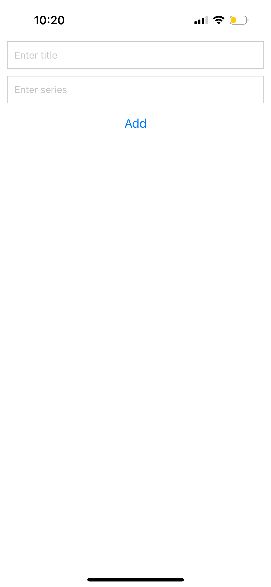
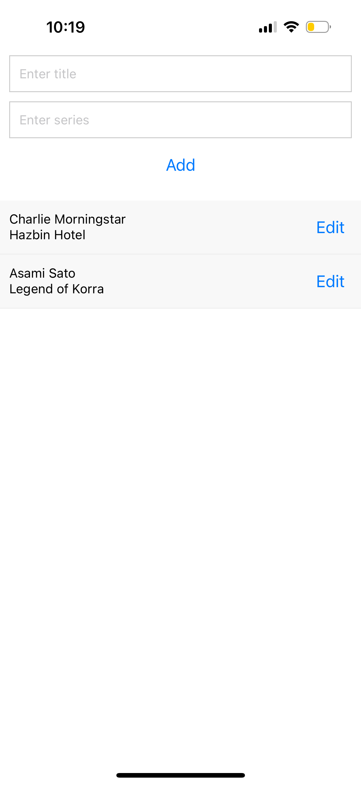
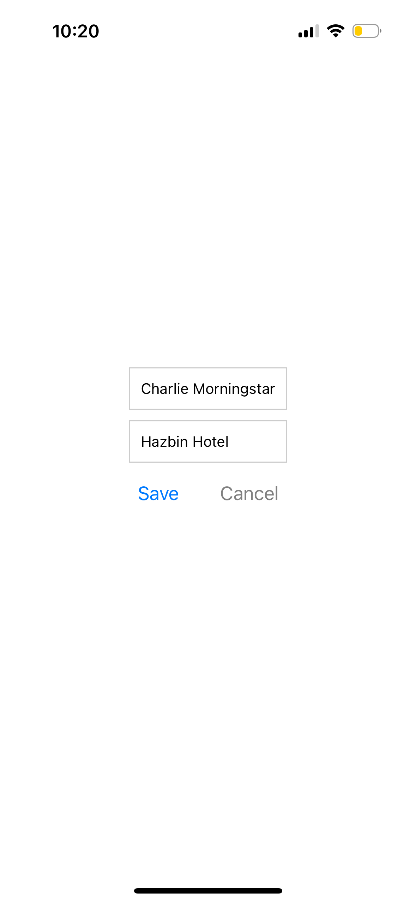

# cosplay-planning

# Cosplay Planning App

## Description
This mobile app allows users to plan and organize their cosplay ideas.

## Features
- Add new cosplay ideas with details such as title, series, progress status, completion date, and reference images.
- Edit existing cosplay ideas.
- Delete cosplay ideas.
- View a list of all cosplay ideas.

## Screenshots




## How to Run
To run this app on your local machine:
1. Clone this repository.
2. Navigate to the project directory.
3. Install dependencies: `npm install`.
4. Start the Expo development server: `npm start`.
5. Scan the QR code using the Expo Go app on your mobile device.

## Video Demonstration
https://youtube.com/shorts/EeyJA0T9__s?feature=share

## Code
### App.js
```javascript
// import React, { useState } from 'react';
import { StyleSheet, View, FlatList, Modal, Button } from 'react-native';
import ListItem from './components/ListItem';
import AddItem from './components/AddItem';
import EditItem from './components/EditItem';

export default function App() {
  const [cosplayIdeas, setCosplayIdeas] = useState([]);
  const [selectedItem, setSelectedItem] = useState(null);
  const [isEditModalVisible, setIsEditModalVisible] = useState(false);

  // Function to add a new cosplay idea
  const addCosplayIdea = (idea) => {
    setCosplayIdeas([...cosplayIdeas, idea]);
  };

  // Function to delete a cosplay idea
  const deleteCosplayIdea = (id) => {
    setCosplayIdeas(cosplayIdeas.filter((item) => item.id !== id));
  };

  // Function to open edit modal
  const openEditModal = (item) => {
    setSelectedItem(item);
    setIsEditModalVisible(true);
  };

  // Function to close edit modal
  const closeEditModal = () => {
    setIsEditModalVisible(false);
    setSelectedItem(null);
  };

  // Function to edit a cosplay idea
  const editCosplayIdea = (editedItem) => {
    setCosplayIdeas(cosplayIdeas.map((item) => (item.id === editedItem.id ? editedItem : item)));
  };

  return (
    <View style={styles.container}>
      <AddItem addCosplayIdea={addCosplayIdea} />
      <FlatList
        data={cosplayIdeas}
        renderItem={({ item }) => (
          <ListItem item={item} deleteCosplayIdea={deleteCosplayIdea} openEditModal={openEditModal} />
        )}
        keyExtractor={(item) => item.id.toString()}
      />
      <Modal visible={isEditModalVisible} animationType="slide">
        <View style={styles.modalContainer}>
          <EditItem item={selectedItem} editCosplayIdea={editCosplayIdea} closeModal={closeEditModal} />
        </View>
      </Modal>
    </View>
  );
}

const styles = StyleSheet.create({
  container: {
    flex: 1,
    paddingTop: 60,
  },
  modalContainer: {
    flex: 1,
    justifyContent: 'center',
    alignItems: 'center',
  },
});
